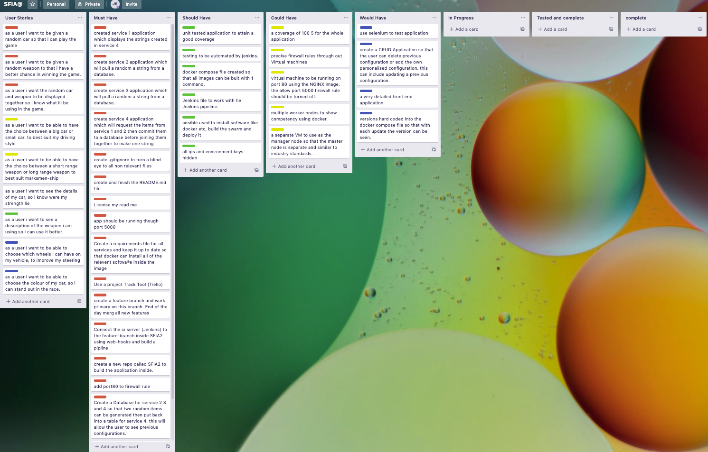

# SFIA2
DevOps Core Practical Project Specification

#### Objective: The personal objectives listed below relate directly to the skills listed in the **[ SFIA 7 framework ](https://www.sfia-online.org/en/framework/sfia-7)**
 
 
--- 

### Materials:

---

### Contents
1. [Executive Summary & Critical Review](#Executive-Summary-&-Critical-Review)
    1. Aim  
    1. My Method
    1. Summary

2. [Architecture](#Architecture) 
    1. Database Structure - CRD & SQL Tables
    1. CI Pipeline

3. [Project Tracking](#Project-Tracking)

4. [Testing](#Testing)

5. [Risk Assessment](#Risk-Assessment)

6. [Conclusion](#conclusion)
    1. Identified Issues
    1. Future Improvements

7. [Reference](#Reference)

8. [license](#Mit-Licence)

---
## Executive-Summary-&-Critical-Review
### Aim
The Aim of this Project was to successfully Create an Application Which gives the user the ability to generate random “Objects” upon a set of predefined rules.
* with full expansion on tasks needed to complete the project.
* This could also provide a record of any issues or risks that you faced creating your project.
* An Application fully integrated using the Feature-Branch model into a Version Control System which will subsequently be built through a CI server and deployed to a cloud-based virtual machine
* If a change is made to a code base, then Web hooks should be used so that Jenkins recreates and redeploys the changed application
* The project must follow the Service-oriented architecture that has been asked for.
* The project must be deployed using containerisation and an orchestration tool.
* •	As part of the project you need to create an Ansible Playbook that will provision the environment that your application needs to rules

### My Method
The SFIA2 project is an application with the main focus is to generate a random car and weapon and display in the front end page. This is done by using 4 microservices which depend on each other to work.

### Microservices

* service 2 and 3 will utilise a function simultaneously which will make a request to a database to gather a random item. The random item “car” will be stored as string in service 2 along with the weapon in service 3.

* Service 4 will make a request to service 2 and 3 and use both variables and append them to a string.

* Service 1: is the front end of the website were it will make a request to the string ade in service and display it in the front end of the application. 

Below is a service architecture diagram 

### Summary
Summary:
To summarize a successful microservice application was created. The application is dockized utilizing docker swarm. Ansible provisions the environment using a playbook.yaml and the application is deployed using Jenkins pipeline and a robust system that allows continuous development and deployment without effecting the experience of the user. In other words, the application can be load balanced using webhooks from docker, Jenkins and GIT hub so that updates can be made whilst the application is still live. The whole application was tested with 100% coverage however using unit test. Along with this, risks were identified, and a risk assessment was created to take precaution whilst completing this project. Some issues have been stated in the Trello Board along with improvements to these issues in the conclusion. Learning from SFIA1 best practices was applied throughout. Some of which include using a feature primarily to develop my code, improvement to the reliability of the project by producing an 100% test coverage and showing how I persisted dated in the database by displaying this on a separate page in the frontend of the application. a display of this page can be found below.

---

## Architecture

### Entity Relation ship diargram
Illustrated below is 3 tables of which I planned to include in my project within one Database. the relationship between each table can be seen using the relevant connections and foreign/primary keys.  Essentially the car and weapon table are the same and they pass data to the CarConfig table as a request from service 4. Although service four commits the data from service 2 and 3 service 4 essentially uses this data as a foreign key. The Carconfig table can have 0 to many weapons and cars from each table. 

### Ci Pipeline

This section will show the deployment on the application. Using Advanced Jenkins deployment, a Jenkins file was made to configure the application. The benefits of this is so that the configuration can be version controlled, and easily altered. This file will source the environment variables build the swarm of which the ansible playbook has prepared and then build all images using the docker compose file and push the latest of that to docker hub before deploying application. a total o 100 + builds were made to complete the applicatio and The three stages of the Jenkins build can  below.

4 microservices are created including a 5th service Nginx. The Nginx tool can be seen to the far right of the diagram below with the main function to reverse proxy between Port 80 of the servers, and port 5000 of the frontend container. To assure communication of containers with in the swarm, a network has be created and applied for all.

To elaborate on some of the technologies used in the CI pipeline is as follows:

•	GitHub: Version Control System*
•	Jenkins: Continuous Integration Server*
•	GCP - to create the virtual environment and also set up the foundation of our Databases using MySQL.
•   Trello: Kanban board and Project tracking*
•	Docker: Containerisation
•	Docker Swarm + Stack: Orchestration
•	Dockerhub: Version Control for Docker Images and Containers
•	Ansible: Configuration Management
•	NGINX: Load Balancing
•	VS Code/Python - is an interpreter which allows better visualisation when building the flask application using python. this is where the sorce code for the front/back end of the application was developed. some languaed covered  were: 
o	Python 3: Logic and Functionality*
o	HTML: Front-end GUI design*
o	CSS: Styling and design of front-end GUI*
o	Flask: Connects front-end and back-end*
o	Jinja2: Pass variables between Python and HTML*
o	MySQL: Allows for access of SQL Databases, as well as query-based functions*
o	Groovy: to configure the jenkins file
o   Linux: to write scripts for for jenkins to run 

---

## Project-Tracking

### Trello Board
This board was used to highlight the user stories/tasks and keep the development of the project on track. the MOSCOW principle was applied by colour coding what must be done (red), should be done (green), could be done (blue) and would be done (yellow). Following a DevOps mindset and agile methodology the User Stories can be seen to the far left. from this the sprint and backlog was created and sorted in terms of priority using the MOSCOW principle. All task with a red label must have been complete for the CRUD Application to be successful. Below is pre sprint, frist sprint and final sprint.

As you can see all user stories have been created and all the sprint backlog. This helps as I can keep referring to this tool to understand what need to be done next.

As you can see some of the should have, have been completed. the main functionality of the application being completing the services in order for the application to perform.

in conclusion all must haves had been met. there are some would have, could have and should haves left but this could be used to improve the application. for example including more nodes is a could have task which would have a major priority in scaling the application.

---

## Testing 
Illustrated below is the sorce code along with the test coverage for each service. a test coverage of 100% was achaveived fort he application.

the home page was tested by seeing if if the page responded with a status code of 200 which means the request has sucseeded.

the code for service 2 and 3 are identicle as each function pulls data from a database at random query the table using the id. the status code for both pages wa 200 and also that both services has access to the database. 

service 4 was tested by seeing if the request from service 2 was the right string. be several time inorder for the test to pass. this test implies service f4 communicates with service 2 and 3 and also does retrieve data.
---
### Risk Assessment
The Risk assessment below contains some of the possible risks when creating an application during this cohort. The likelihood of the risk are scored using a colour code and given a number. red be very high risk, orange being high risk and yellow being moderately low risk. An overall score for each risk can be found in the last column.

the risk assessment was updated throughout out the project because of the exposure of new risk that could possibly occur. for example, the application breaking most of time the virtual machine was switched off or the broadband disconnected. Using proper practices like switching off machines reduces the amount of resources spent on the machine whilst it was inactive however this of course came with a cost. each time the firewall rules had to re-configured along with relevant webhooks resulting time being spent on configuration and not focused on continuous deployment. The procedure it should be considered to use flexible ip so that with this disruption the ip addreses stay fixed. this column was then added to the to the risk assessment to view the whole risk assessment click [here](Documents/RiskAssessment.xlsx).

--- 

## Conclusion

In conclusion, I followed the requirement that set on my Kanban Board and work with the MVP concept which resulted in a successful application which generates a Radom string utilizing data from a database and persisting this data in the front end. the application has been dockerised using of 5 microservices including nginx which allows access to the application through port 80 as well as successfully load balancing the application any time changes are made. Risks were identified along with clear documentation of the architecture in this application. Working on a feature branch allowed me to work without worrying about breaking the application as the master branch always had the working application from the most recent push. I now have a clear understanding how to dockerise, load balance and deploy my application through Jenkins pipeline and feel I have defiantly improved the value I can bring to the industry as an DevOps Engineer. a

### Identified Issues

some of the main issues faced whilst creating this application are as follows:
* Docker unable to webhook with Github. Essential docker would have triggered a rebuild of images anytime changes were made to the docker files within the repository on git however this was not the case. To overcome this more time could be spent on debugging this process however in hindsight, a function was hardcode into a script run by Jenkins pre deployment so that all images are rebuilt using “docker-compos build” then pushed to docker hub each time a new change is made.
* Unable to delete table in the database so that CRUD marking scheme could be fulfilled. The delete function test inside the route.py for service 1 would not commit the change to the database. To overcome this more time could be spent in developing a function so that the dockerised application could have CRUD Functionality.
* IP address constantly changing and breaking application. To be more efficient with the GCP accounts vms would be switched off of a night. The result would sometimes change the ip-address of these machines which mean Jenkins would not receive the webhook from git and my the master node could no longer SSH into the manger node. To overcome this more money could be spent in tools like an elastic ip address which will stop the ip from changing if machines or internet becomes disconnected.

### Future Improvements
in conclusion to the identified issues, the improvements to be made to the application would be as follows:
* connect a webhook between docker and GitHub to avoid unnecessary coding inside source code as well as best practices followed utilising the tools feature rather than working around them.
* expand on the use of the feature branch and create more branches off if this branch. this could help prepare me with industry standards and improve my navigation through version code system.
* Develop Groovy syntax to become more versatile with working with Jenkins pipeline. this could be done by eliminating scripts within the Jenkins file and having the configuration with eh pipeline stage instead. this would improve my value as a DevOps Engineer.
* Applied Integration Testing to the application. this will test how all the different functionality’s of my website work together. this will improve the accuracy of my tests and overall increase the reliability of the website. I would have done this by importing unnittest and all the dependencies.
* Along with further testing techniques, the testing could be automated. This can be done by creating another build stage and coding commands to test the application.
* scaling out application. more nodes and more replicas could be created in order to servers many more users request at once.

## Installation guide

### Intallation guide Improvements
Preparing Enviornment
* 2 Ubunto machines runnig atleast version 18.04. GCP are a great resource to use as you can create these machines virtually at a cheap cost.
* a Database to store the data, Again GCP have a great resource called mySql. 
* as this application is dockerised and deployed through swarm, SSH keys will need to be generated and linked to relevent machines inorder to SSH into one and another.
 
### Manager node 
* Jenkins will need to be installed and Enables on this node with a pipeline build item. along with this install ansible and clone down this repository as it contains the source code for the application. 
* some bespoke changes will need to be made like, making sure the environment variables are correctly set for your MySql database along with the correct inventory.conf variables.

### Worker node 
* ensure all relevant firewalls are set so that the VM can be SSH into. this will include adding the public key of the machine its SSH form.

As long as the steps are followed precisely above and putting emphasises on the environment variable ssh keys and inventory.conf variables, ansible we manage the rest of the configuration and Jenkins will prepare the environment then deploy the application.

## Author

Jason Sinclair

##  Acknowledgments 

* The QA Consultants for helping with my Development and teaching the required skills to build this application.

## MIT License

Copyright (c) 2020 JasonSinclair95

Permission is hereby granted, free of charge, to any person obtaining a copy
of this software and associated documentation files (the "Software"), to deal
in the Software without restriction, including without limitation the rights
to use, copy, modify, merge, publish, distribute, sublicense, and/or sell
copies of the Software, and to permit persons to whom the Software is
furnished to do so, subject to the following conditions:

The above copyright notice and this permission notice shall be included in all
copies or substantial portions of the Software.

THE SOFTWARE IS PROVIDED "AS IS", WITHOUT WARRANTY OF ANY KIND, EXPRESS OR
IMPLIED, INCLUDING BUT NOT LIMITED TO THE WARRANTIES OF MERCHANTABILITY,
FITNESS FOR A PARTICULAR PURPOSE AND NONINFRINGEMENT. IN NO EVENT SHALL THE
AUTHORS OR COPYRIGHT HOLDERS BE LIABLE FOR ANY CLAIM, DAMAGES OR OTHER
LIABILITY, WHETHER IN AN ACTION OF CONTRACT, TORT OR OTHERWISE, ARISING FROM,
OUT OF OR IN CONNECTION WITH THE SOFTWARE OR THE USE OR OTHER DEALINGS IN THE
SOFTWARE.
