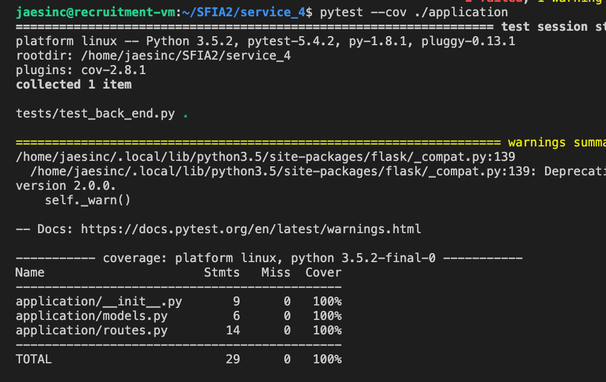

# SFIA2
DevOps Core Practical Project Specification

#### Objective: The personal objectives listed below relate directly to the skills listed in the **[ SFIA 7 framework ](https://www.sfia-online.org/en/framework/sfia-7)**
 
 
--- 

### Materials:

---

### Contents
1. [Executive Summary & Critical Review](#Executive-Summary-&-Critical-Review)
    1. Aim  
    1. My Method
    1. Summary

2. [Architecture](#Architecture) 
    1. Database Structure - CRD & SQL Tables
    1. CI Pipeline

3. [Project Tracking](#Project-Tracking)

4. [Testing](#Testing)

5. [Risk Assessment](#Risk-Assessment)

6. [Conclusion](#conclusion)
    1. Identified Issues
    1. Future Improvements

7. [Reference](#Reference)

8. [license](#Mit-Licence)

---
## Executive-Summary-&-Critical-Review
### Aim
The Aim of this Project was to successfully Create an Application Which gives the user the ability to generate random “Objects” upon a set of predefined rules.
* with full expansion on tasks needed to complete the project.
* This could also provide a record of any issues or risks that you faced creating your project.
* An Application fully integrated using the Feature-Branch model into a Version Control System which will subsequently be built through a CI server and deployed to a cloud-based virtual machine
* If a change is made to a code base, then Web hooks should be used so that Jenkins recreates and redeploys the changed application
* The project must follow the Service-oriented architecture that has been asked for.
* The project must be deployed using containerisation and an orchestration tool.
* •	As part of the project you need to create an Ansible Playbook that will provision the environment that your application needs to rules

### My Method
The SFIA2 project is an application with the main focus is to generate a random car and weapon and display in the front end page. This is done by using 4 microservices which depend on each other to work. the front end of the application can be seen below.

### Microservices
* service 2 and 3 will utilise a function simultaneously which will make a request to a database   to gather a random item. The random item “car” will be stored as string in service 2 along with the weapon in service 3.

* Service 4 will make a request to service 2 and 3 and use both variables and append them to a string.

* Service 1:  is the front end of the website where the both generated items will be seen. 

### Summary
Summary:
To summarize a successful microservice application was created. The application is dockized utilizing docker swarm. Ansible provisions the environment using a playbook.yaml and the application is deployed using Jenkins pipeline and a robust system that allows continuous development and deployment without effecting the experience of the user. In other words, the application can be load balanced using webhooks from docker, Jenkins and GIT hub so that updates can be made whilst the application is still live. The whole application was tested with 100% coverage however using unit test. Along with this, risks were identified, and a risk assessment was created to take precaution whilst completing this project. Some issues have been stated in the Trello Board along with improvements to these issues in the conclusion. Learning from SFIA1 best practices was applied throughout. Some of which include using a feature primarily to develop my code, improvement to the reliability of the project by producing an 100% test coverage and showing how I persisted dated in the database by displaying this on a separate page in the frontend of the application. a display of this page can be found below.

---

## Architecture

### Entity Relation ship diargram

### Ci Pipeline

### service architecture

### Trello Board

---
### Risk Assessment

### Testing 

## conclusion

## MIT License

Copyright (c) 2020 JasonSinclair95

Permission is hereby granted, free of charge, to any person obtaining a copy
of this software and associated documentation files (the "Software"), to deal
in the Software without restriction, including without limitation the rights
to use, copy, modify, merge, publish, distribute, sublicense, and/or sell
copies of the Software, and to permit persons to whom the Software is
furnished to do so, subject to the following conditions:

The above copyright notice and this permission notice shall be included in all
copies or substantial portions of the Software.

THE SOFTWARE IS PROVIDED "AS IS", WITHOUT WARRANTY OF ANY KIND, EXPRESS OR
IMPLIED, INCLUDING BUT NOT LIMITED TO THE WARRANTIES OF MERCHANTABILITY,
FITNESS FOR A PARTICULAR PURPOSE AND NONINFRINGEMENT. IN NO EVENT SHALL THE
AUTHORS OR COPYRIGHT HOLDERS BE LIABLE FOR ANY CLAIM, DAMAGES OR OTHER
LIABILITY, WHETHER IN AN ACTION OF CONTRACT, TORT OR OTHERWISE, ARISING FROM,
OUT OF OR IN CONNECTION WITH THE SOFTWARE OR THE USE OR OTHER DEALINGS IN THE
SOFTWARE.
